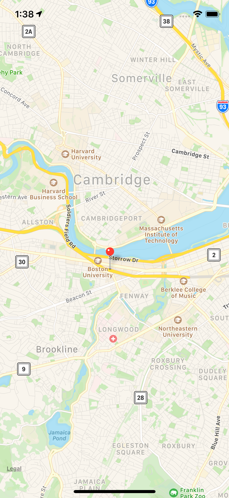
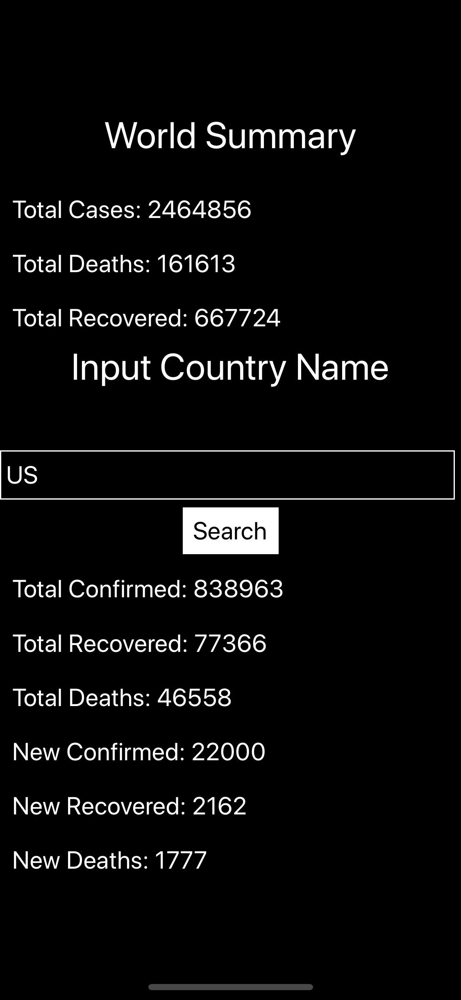

# Covid App

# Setting up the development environment(1st step)
brew install node  
brew install watchman  
sudo gem install cocoapods  
npm install  
npx react-native run-ios  
# 1st App(2nd step)
  

# Map(3rd step)
1.input command "npm install react-native-maps --save-exact" to get the maps package.     
2.set up google maps API key for the iOS SDK.   
3.pod install.  
  

# Data display for covid
1.use https://api.covid19api.com/summary to get the world covid data.  
2.use https://api.covid19api.com/total/country to get each country's covid data.  
3.detais see in step4&5 countrydata.js  
  

# Overlap data with maps
1.Based on step4 overlap the data on maps.  
2.World data is separated with coutry's data, for world,it always appears in the bottom  
but country's data shows when click the marker.
3.Details see in code.  
  
