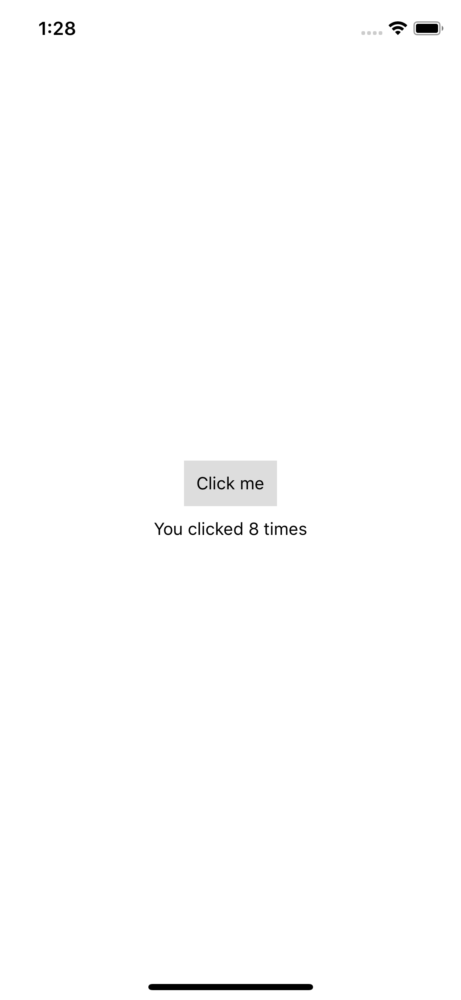

# Covid App

# Setting up the development environment(1st step)
brew install node  
brew install watchman  
sudo gem install cocoapods  
npm install  
npx react-native run-ios  
# 1st App(2nd step)
  

# Map(3rd step)
1.input command "npm install react-native-maps --save-exact" to get the maps package.     
2.set up google maps API key for the iOS SDK.   
3.pod install.  
  

# Data display for covid
  

# Overlap data with maps
